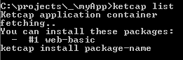
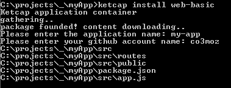

Ketcap
===================

Simplest application backbone creator, boilerplate  archive, small, easy to use.

Usage
--------------

    ketcap list

Gets all boilerplate names from mayonez system. Here you can look it https://github.com/co3moz/ketcap-mayonez. 




> **Developer Note** If you want to add more boilerplate, please clone and create pull request. Thank you :*

How about to install some boilerplate? type this sir,

    ketcap install web-basic
    
Now ketcap downloads the content, when it's done ketcap asks questions about your application like name description etc..
Answer them please, when you done then ketcap will start to create files like lightning.




Mayonez Files
-------------------

This files are magical :O, they simply determine the boilerplate.

Their syntax is simple, code starts with `<|||` and ends with `|||>`, every code block must be named so

```
named-block
<|||
content
|||>
```

except the "folders" and "dialog" block names determines files. folders contains information about folders, dialogs are created for gathering information from developer.

```
dialog
<|||
  application-name Please enter the application name
  application-author Please enter your github account name
|||>
```

> We can use this values with special tags. `<||{` and `}||>` has duty to do this job.
> ```
> package.json
>  <|||
> {
>   "name": "<||{application-name}||>",
>   ...
> ```   

when we install this boilerplate ketcap asks this questions..

```
folders
<|||
  src
  src/routes
  src/public
|||>
```

for create the folders use the folders block and each line must contain folder name.

```
filename
<|||
content
|||>
```

so lastly we create the files with it, you can create more files with more blocks.. Here some bananas

```
dialog
<|||
  application-name Please enter the application name
  application-author Please enter your github account name
|||>

folders
<|||
  src
  src/routes
  src/public
|||>

package.json
<|||
{
  "name": "<||{application-name}||>",
  "version": "1.0.0",
  "description": "test",
  "main": "src/app.js",
  "author": "<||{application-author}||>",
  "license": "MIT"
}
|||>

src/app.js
<|||
  test..
|||>
```


